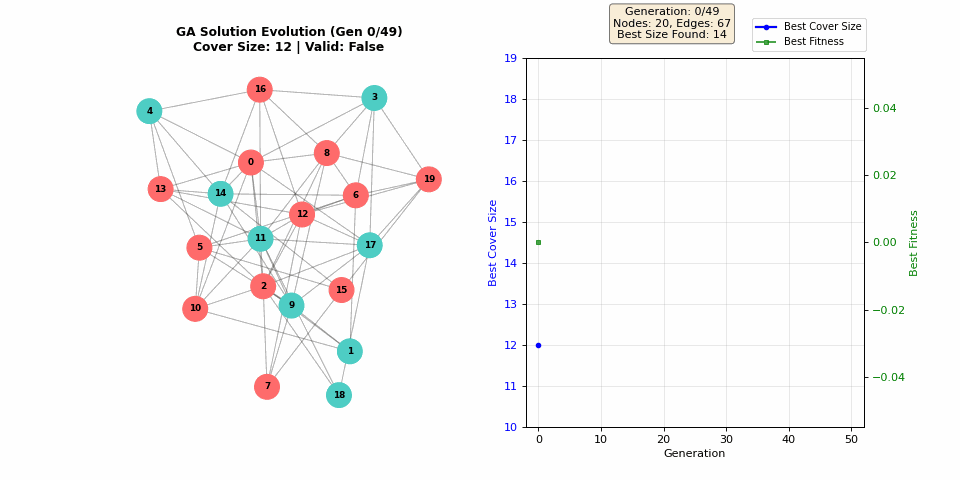
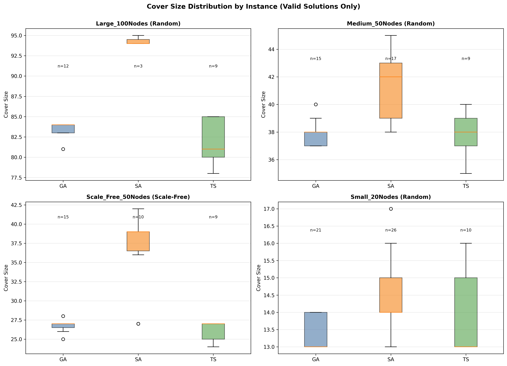
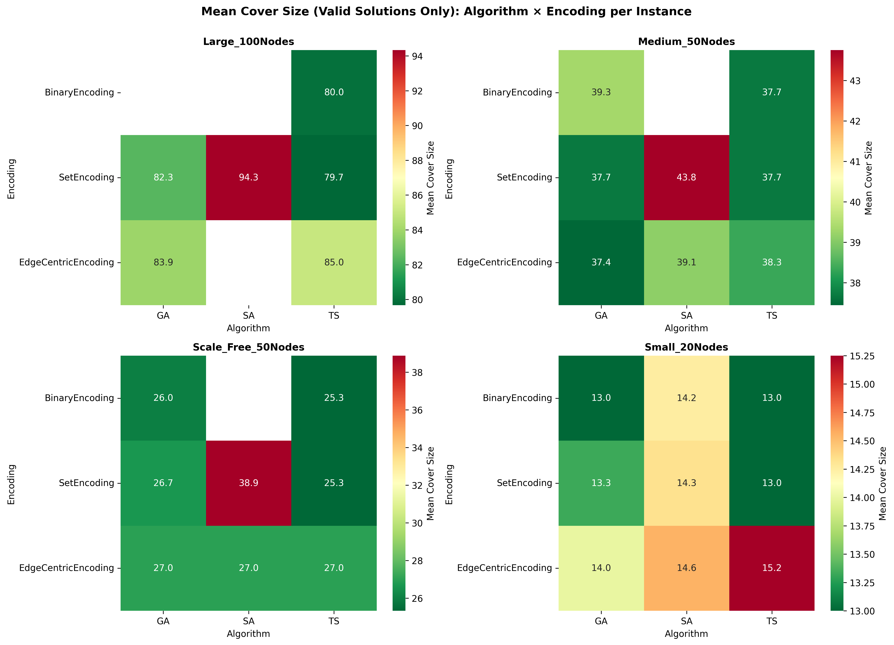
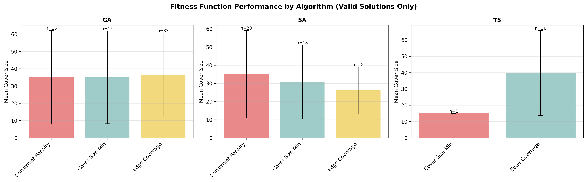

# Minimum Vertex Cover Optimization using Meta-Heuristics

[](https://github.com/yazid-hoblos/MVC-Metaheuristics)
[](https://github.com/yazid-hoblos/ENGA)
[](https://www.python.org/)

## Overview

This project implements and compares three meta-heuristic algorithms for solving the **Minimum Vertex Cover (MVC)** problem:
- **Genetic Algorithm (GA)** - Population-based evolutionary optimization
- **Simulated Annealing (SA)** - Probabilistic trajectory-based search  
- **Tabu Search (TS)** - Adaptive memory-based local search

The study evaluates **3 problem encodings** (binary vector, set-based, edge-centric) and **3 fitness function classes** (original hard-penalty and optimized smooth-landscape functions) across 12 benchmark graph instances.

**Key Finding**: Set-based encoding with edge coverage fitness achieves the best balance of solution quality and feasibility. Optimized fitness functions (smooth penalties, adaptive weighting, repair-based) significantly improve search landscape navigability.

### Genetic Algorithm in Action

<p align="center">
  
</p>

*Genetic Algorithm evolution on a small MVC instance showing convergence from random initialization to optimal vertex cover (red nodes). The animation demonstrates population-based search dynamics and fitness improvement over generations.*

## Problem Definition

**Minimum Vertex Cover**: Given graph $G = (V, E)$, find the smallest subset $C \subseteq V$ such that every edge $(u,v) \in E$ has at least one endpoint in $C$.

- **Complexity**: NP-complete
- **Applications**: Network design, bioinformatics, resource allocation

## Repository Structure

```
minimum_vertex_cover/
├── src/
│   ├── problem.py              # MVC problem definition and instance generator
│   ├── mvc_encodings.py        # Three problem encodings (binary, set, edge)
│   ├── mvc_fitness.py          # Original fitness functions (hard penalties)
│   ├── mvc_fitness_opt.py      # Optimized fitness functions (smooth landscape)
│   ├── ga.py                   # Genetic Algorithm
│   ├── sa.py                   # Simulated Annealing
│   ├── ts.py                   # Tabu Search
│   └── experiments.py          # Experiment orchestration
├── report/
│   ├── main.tex                # Technical report (LaTeX)
│   └── appendix.tex            # Algorithm pseudocode
├── results/                    # Experimental results (CSV files)
├── instances/                  # Benchmark graph instances
├── run_experiments.py          # Main experiment runner
└── requirements.txt            # Python dependencies
```

## Reproducibility

Install all dependencies:
```bash
pip install -r requirements.txt
```

### Reproducing Baseline Results
```bash
# Run baseline experiments (3 algorithms × 3 encodings × 3 fitness × 12 instances × 3 runs)
python run_experiments.py --output results/baseline_results.csv
# Expected output: CSV with 324 rows

# Could specify one encoding and one fitness function with:
# python run_experiments.py --encoding BinaryEncoding --fitness EdgeCoverageOptimization
# Check all options with: python run_experiments.py --help
```

### Reproducing GA Parameter Analysis
```bash
# Analyze GA sensitivity to generations and mutation rates
python ga_parameter_analysis.py
```

### Reproducing Report Figures
```bash
# Generate all stratified analysis plots
python generate_stratified_plots.py
```

### Datasets
Benchmark instances are generated programmatically:
- **Small**: 10-20 nodes, 15-50 edges (Erdős-Rényi, p=0.3)
- **Medium**: 30-50 nodes, 90-300 edges (Erdős-Rényi, p=0.2)  
- **Large**: 60-80 nodes, 360-1000 edges (Erdős-Rényi, p=0.15)

### Related Projects
- **ENGA Framework**: [github.com/yazid-hoblos/ENGA](https://github.com/yazid-hoblos/ENGA) 


## Key Results

**Baseline Experiments** (324 runs total: 3 algorithms × 3 encodings × 3 fitness × 12 instances × 3 runs):

| Algorithm | Valid Solutions | Avg Cover Size | Runtime |
|-----------|-----------------|----------------|---------|
| **GA**    | 48.1%           | 34.78 ± 24.78  | 2.66s   |
| **SA**    | 55.6%           | 35.58 ± 25.70  | 0.14s   |
| **TS**    | 34.3%           | 34.14 ± 24.13  | 2.25s   |

**Optimized Fitness Functions** (same experimental design with smooth-landscape functions):

| Algorithm | Valid Solutions | Avg Cover Size | Runtime |
|-----------|-----------------|----------------|---------|
| **GA**    | 33.6%           | 32.65 ± 23.07  | 2.60s   |
| **SA**    | 37.0%           | 32.65 ± 23.14  | 0.14s   |
| **TS**    | 43.5%           | 32.28 ± 22.64  | 2.18s   |

**Key Findings**:
- **Set encoding + edge fitness**: Best overall performance across algorithms
- **Optimized fitness functions**: Eliminate death-penalty cliffs, improve TS validity by 9.2%
- **SA**: Fastest algorithm (100ms), excellent quality when feasible
- **TS**: Benefits most from smooth fitness landscapes
- **Instance size**: TS outperforms on large graphs (>50 nodes)

### Visual Results

<p align="center">
  
</p>

*Solution quality stratified by instance size (small, medium, large). Clear progression showing algorithm behavior across different graph scales.*

<p align="center">
  
</p>

*Heatmap of average cover sizes across algorithm-encoding-fitness combinations for each instance. Darker colors indicate smaller (better) vertex covers.*

<p align="center">
  
</p>

*Comprehensive comparison of fitness functions showing both solution quality and validity rates. Optimized functions provide smoother search landscapes.*


## References

- **Karp (1972)**: Reducibility among combinatorial problems - NP-completeness of Vertex Cover
- **Kirkpatrick et al. (1983)**: Optimization by simulated annealing - SA algorithm foundation
- **Holland (1975)**: Adaptation in natural and artificial systems - GA theoretical basis  
- **Glover (1989, 1990)**: Tabu search fundamentals and applications
- **Karakostas (2005)**: Better approximation algorithm for vertex cover  
- **Hoblos (2025)**: Evolving Network Generation with Augmentation (ENGA) preprint
---

